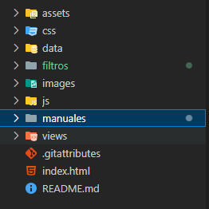

<h1 align="center"> TurisAR </h1>

   
   

*Universidad de San Carlos de Guatemala*  
*Escuela de Ingeniería en Ciencias y Sistemas, Facultad de Ingenieria*  
*Inteligencia Artificial 1, 1er. Semestre 2025.*  
*Manual Tecnico.*  
___

Sistema inteligente basado en lógica computacional que asista a los usuarios en la
identificación de la facultad, carrera universitaria y horario más adecuado según sus aptitudes,
habilidades, intereses y preferencias, utilizando Tau-Prolog para el razonamiento lógico.

## ✅ **ESTRUCTURA DEL PROYECTO**
El proyecto tiene una estructura de carpetas con todo el contenido del mismo.
* **assets:** compilado de los marcadores para los diferentes lugares.
* **css:** archivos de estilo para las vistas.
* **data:** continene la base de datos en un archivo JSON.
* **filtros:** contiene las imagenes PNG utilizadas para los filtros.
* **images:** marcadores de los lugares.
* **views:** codigo html de cada vista.
* **js:** scripts para la las funcionalidades.
* **manuales:** manual de usuario y manual tecnico.
* **index.html:** página de inicio de TurisAR.

___
## 📝 Módulos JavaScript (carpeta js)

En `js/` residen los scripts principales del proyecto:

1. **admin.js**  
   - Descripción: Gestiona la sección de administración (lugares y filtros).  
   - Funcionalidades:
     • Manejo de File System API (selección de carpetas para imágenes y filtros).  
     • Lectura/escritura de JSON (lugares y filtros) con fallback a `localStorage`.  
     • CRUD de lugares (`renderPlaceList()`, `openPlaceModal()`, `getPlaces()`, `setPlaces()`).  
     • CRUD de filtros (`renderFilterList()`, `openFilterModal()`, `getFilters()`, `setFilters()`).  
     • Importación y exportación de datos JSON (`setupSmartImport()`, `setupExport()`).  
     • Inicializa MindAR para la pestaña AR y renderiza botones de filtro.

2. **filtro.js**  
   - Descripción: Página de filtros AR tras seleccionar un lugar.  
   - Funcionalidades:
     • Carga configuración de filtros (`loadFilterConfig()`) y selección según `currentTarget`.  
     • Inicializa cámara y Face‑AR con MindAR + Three.js (`startCamera()`, `initFaceFilter()`).  
     • Renderiza un plano con el filtro 3D (`filterMesh`) sobre el rostro.  
     • Botón “Tomar y Guardar Foto”: captura el canvas combinado (fondo + vídeo + filtro) y descarga un PNG.

3. **index.js**  
   - Descripción: Página principal con detección de marcadores para mostrar información.  
   - Funcionalidades:
     • Inicializa AR de marcadores con MindARThree (`initAR()`).  
     • Carga datos de `DB.json` y genera dinámicamente `<a-entity>` por target.  
     • Muestra/oculta información (título, descripción, vídeo, enlaces) al detectar/perder marcador.  
     • Botones de acción para ir a filtros, ver más información o abrir Google Maps.

4. **login.js**  
   - Descripción: Gestiona la autenticación en el cliente para acceso a la sección de admin.  
   - Funcionalidades:
     • Validación de credenciales (usuario/contraseña).  
     • Muestra alertas de éxito o error (`showAlert()`).  
     • Almacena estado en `sessionStorage` y redirige al dashboard de administración.

___
## ✅ **IMPORTACION DE MINDAR**

En los scripts que implementan realidad aumentada (`index.js`, `filtro.js`, `admin.js`) se importa:

• `import * as THREE from "three"`  
• `import { MindARThree } from "mindar-face-three"`  
• `import { CSS3DRenderer } from "three/addons/renderers/CSS3DRenderer.js"`  

Estas librerías permiten:
- Detección y seguimiento de marcadores faciales o de imagen.  
- Renderizado de escenas 3D sobre el feed de la cámara.  
- Integración de resultados AR en el DOM (CSS3DRenderer).

___
## ✅ **INICIO**

Al cargar la aplicación se ejecutan:

1. `window.addEventListener('load', …)` o `DOMContentLoaded`: arranca la cámara y carga datos.  
2. `startCamera()`: solicita acceso a la cámara frontal y enlaza el stream al `<video>`.  
3. `renderPlaceList()` / `renderFilterList()`: pintan las tablas de lugares y filtros en la pestaña de administración.  
4. `setupExport()` y `setupSmartImport()`: configuran la importación/exportación de JSON.  
5. Al cambiar a la pestaña AR:
   - `initAR()` (en index.js) o `initFaceFilter()` (en filtro.js): inicializan MindARThree, crean la escena, añaden luz, mallas y ancors.  
   - Se carga la configuración de filtros desde `localStorage` o `filtros.json` y se aplican al objeto 3D.

___
## ✅ **MÓDULO DE ADMINISTRADOR**

Script: **admin.js**  
- Gestión de directorios con File System Access API (`ensureImagesFS()`, `ensureFiltersFS()`).  
- Lectura y escritura de JSON (lugares y filtros) con fallback a `localStorage` (`readJSON()`, `writeJSON()`).  
- CRUD de lugares:
  • `getPlaces()`, `setPlaces()`  
  • `renderPlaceList()`, `openPlaceModal()`  
- CRUD de filtros:
  • `getFilters()`, `setFilters()`  
  • `renderFilterList()`, `openFilterModal()`  
- Importación inteligente de archivos JSON (`setupSmartImport()`).  
- Exportación a JSON descargable (`setupExport()`).  
- Inicialización de MindAR en la pestaña AR y renderizado dinámico de botones de filtro.

___
## 😜 **TECNOLOGÍAS UTILIZADAS**

* HTML5  
* CSS3 (Bootstrap 5)  
* JavaScript ES6 (módulos)  
* Three.js  
* MindAR-face-three  
* File System Access API  
* Web Storage API (localStorage / sessionStorage)  

## ✒️ Autores

* *202102864* - **Alvaro Esaú Arenas González**
* *202000127* - **Moises Antonio Conde Hernandez**
* *201603028* - **Oscar Eduardo Morales Girón**