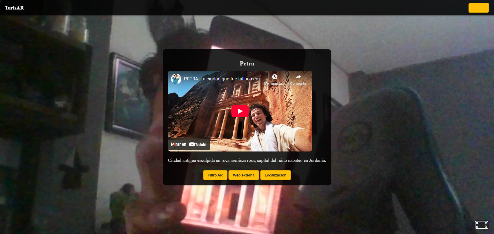
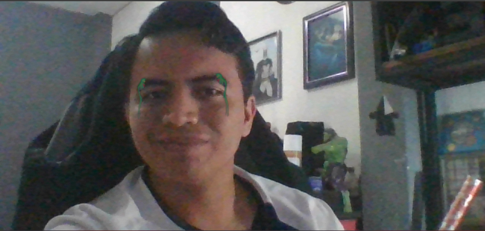
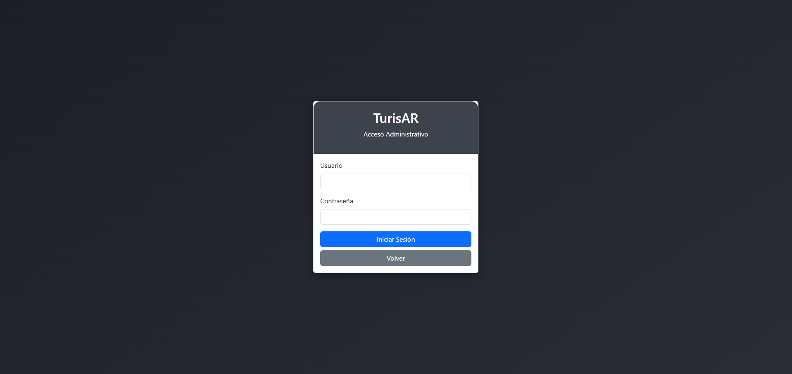
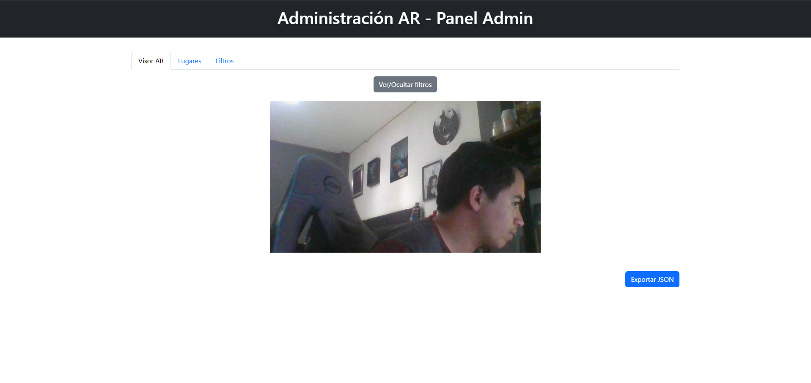

<h1 align="center"> TurisAR </h1>

   
   

*Universidad de San Carlos de Guatemala*  
*Escuela de Ingeniería en Ciencias y Sistemas, Facultad de Ingenieria*  
*Inteligencia Artificial 1, 1er. Semestre 2025.*  
___

TurisAR es un innovador sistema de Realidad Aumentada desarrollado por
estudiantes del curso Inteligencia Artificial 1 de la Universidad de San Carlos de Guatemala, con el propósito de revolucionar el turismo a nivel global. Su objetivo es proporcionar una experiencia interactiva y enriquecedora al permitir a los usuarios acceder a información detallada sobre sitios icónicos al reconocerlos en tiempo real.

Como punto de partida, el proyecto se ha enfocado en fortalecer el turismo
guatemalteco mediante la integración de las 7 maravillas de Guatemala, junto con las 7 maravillas del mundo, ofreciendo datos históricos, culturales y multimedia que fomentan el aprendizaje y la exploración intuitiva. TurisAR busca convertirse en una herramienta de referencia para viajeros y estudiantes, con la visión de expandir su alcance e incluir las maravillas y atracciones turísticas de distintos países, promoviendo así la difusión del patrimonio cultural y natural a nivel internacional.

## ✅ **INICIO**
La aplicación permite a los usuarios visualizar información interactiva en AR sobre las 7 maravillas del mundo y las 7 maravillas de Guatemala. Para ello se implementaron marcadores AR para reconocer cada punto turístico y desplegar información relevante. 
Esta información se muestra por medio de Realidad Aumentada en una interfaz interactiva y amigable para el usuario que contiene la siguiente información del sitio:
* Contenido multimedia del sitio.
* Ficha de Información y datos relevantes.
* Enlace a un sitio web externo con información del punto turístico.
* Enlace a la ubicación en mapa del punto turístico.

___

## ✅ **FILTROS TEMATICOS**
Además, se tiene una opción que permite tomar una fotografía en el lugar utilizando un filtro temático del punto turístico. Este filtro es unico y representativo del lugar, la opción se obtiene al presionar el botón en la tarjeta que se despliega sobre cada lugar.

___

## ✅ **MODULO DE ADMINISTRADOR**

El módulo administrativo esta restringido a usuarios con credenciales predefinidas y requiere un proceso de autenticación mediante usuario y contraseña.

Al ingresar, el administrador tiene acceso a un panel de gestión que le permite administrar la base de conocimiento del sistema. 
En este panel se encuentra distintas secciones, entre ellas la gestión de lugares y filtros.

## ✒️ Autores

* *202102864* - **Alvaro Esaú Arenas González**
* *202000127* - **Moises Antonio Conde Hernandez**
* *201603028* - **Oscar Eduardo Morales Girón**